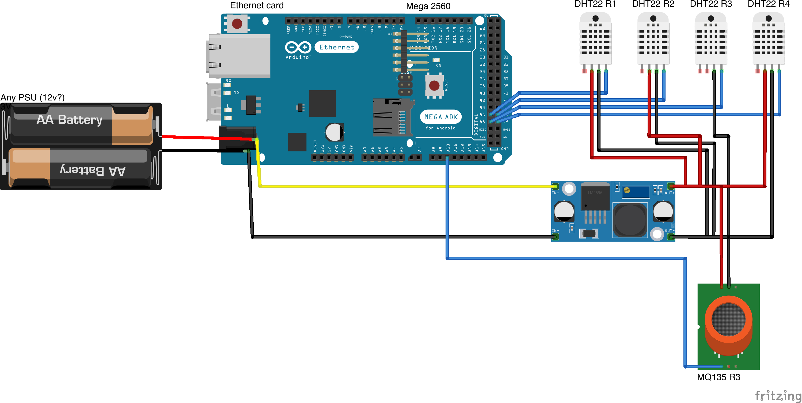

# MUH Ilmava

MUH Ilmava Arduino temperature sensing hacks, which idea is to learn from gathering temperature data how this unit works.  
This repository code could possibly get some more "features" based on findings and learning curve.

MUH Ilmava is a house ventilation system and this specific unit is very old one from ~1989.

Sensor placing
============
Temperature sensors labeled as R1, R2, R3, R4 are placed in following way.  
`R1` - Incoming outside air.  
`R2` - Outgoing air to rooms.  
`R3` - Returning air from rooms.  
`R4` - After heating coil (used to heat air to avoid heat recovery cell to freeze).
  

(Image was taken before filter change and cleaning of unit)

Schematic
============
 

OLED screen notes
============

Module
-----
SSD1306 OLED

Pinouts
-----
* SDA -> A4 (i2c)
* SCL -> A5 (i2c)
* GND -> Ground
* VDD -> 5v (Screen pin labeled as VCC or VDD)

Required libraries
-----
* Adafruit BusIO
* Adafruit-GFX-Library
* Adafruit_SSD1306
