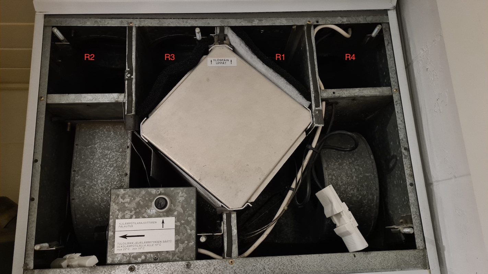

# MUH Ilmava

MUH Ilmava Arduino temperature and humidity sensing hacks, 
which idea is to learn from gathering temperature and humidity data how this unit works.
Another purpose is to see how much this one heat transfer cell can gather heat and how much is dumped to `R4` channel.  
This repository code could possibly get some more "features" based on findings and learning curve.

MUH Ilmava is a house ventilation system and this specific unit is very old one from ~1989.


Sensor placing
============
Temperature|humidity sensors labeled as R1, R2, R3, R4 are placed in following way.  
`R1` - Incoming outside air.  
`R2` - Outgoing air to rooms.  
`R3` - Returning air from rooms.  
`R4` - Waste air outside house.





Schematic
============
 


Backend
============
Is located at `/server` folder. It's a simple express backend which takes data and stores it into PostgreSQL database. 


Plotting
============
For plotting data I used `Superset`. I run it locally with Docker as their documentation instructs.
Get started with Superset [here](https://superset.apache.org/).

Why Superset?
* It doesn't no longer make sense to create custom plotting front end since Superset just gives you 
so many possibilities.

 

 


Queries
============


Need
----
is to find out how much heating coil has used kWh's of energy.  
`500` = coil watt rating.
```postgresql
select
    500 * (duration_minutes / 60) / 1000 as used_kwh
from (
         select min("createdAt")                       as started,
                max("createdAt")                       as ended,
                EXTRACT(EPOCH FROM (max("createdAt") - min("createdAt"))::INTERVAL) /
                60                                     as "duration_minutes",
                avg(outgoing_air_to_rooms_temperature) as "avg_temp"
         from measurements
         where outgoing_air_to_rooms_temperature > 21
           and outgoing_air_to_rooms_humidity < 27
         group by "createdAt"::date
     ) as m
```

Coil is not on the whole time so maybe right value is about 70% of it:

 
